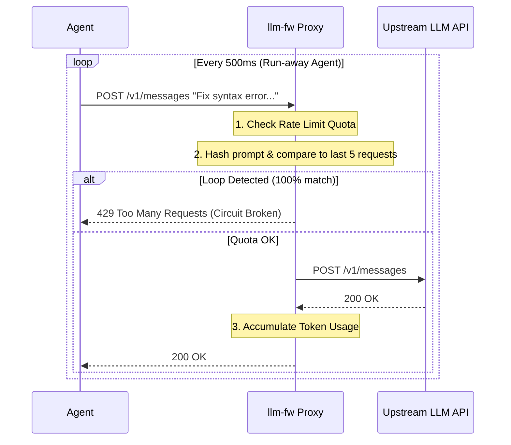

# Specification: Cost Control & Agentic DoS Protection (SPEC-dos.md)

This specification details how `llm-fw` will protect users from run-away autonomous agents, infinite tool-calling loops, and unexpected API billing spikes by implementing robust rate limiting and behavioral heuristic controls.

---

## 1. The Threat Model: Agentic DoS & Billing Exhaustion

Modern LLM development heavily features autonomous agents (e.g., AutoGPT, LangChain, CrewAI) that can invoke tools and make sequential API calls without human intervention. This introduces significant risks:

*   **Recursive Loops**: An agent fails to use a tool correctly and repeatedly retries the exact same prompt hundreds of times per minute.
*   **Malicious Exhaustion**: An indirect prompt injection forces the agent into a loop designed to rack up API charges (Denial of Wallet) or exhaust local compute resources.
*   **Unbounded Quotas**: Agents running background tasks silently consuming thousands of expensive tokens (e.g., Claude 3 Opus) without the developer noticing.

Because `llm-fw` sits between the agent and the API, it is perfectly positioned to act as a circuit breaker.

---

## 2. Architecture: The Circuit Breaker

The protection relies on two main components: a **Quota Manager** (tracking token/request counts over time) and a **Loop Detector** (analyzing prompt similarity over short time windows).

---

## 3. Detection Strategies

### Strategy 1: Hard Rate Limiting (Token & Request Quotas)
A standard leaky bucket or sliding window algorithm applied to the local proxy.
*   **Requests Per Minute (RPM)**: Block if the agent exceeds X requests per minute.
*   **Tokens Per Minute (TPM)**: Track estimated input/output tokens (using lightweight local tiktoken/llama-tokenizer estimates) and throttle if exceeded.
*   **Session Budget**: Hard limit on the total cost/tokens allowed before the proxy requires manual dashboard approval to unpause.

### Strategy 2: Behavioral Loop Detection (Similarity Hashing)
Agents stuck in a loop often send identical or highly similar prompts.
*   **Exact Match Loop**: Maintain a sliding window of the last 10 requests. If the exact same request body (hash) is seen $> 3$ times within 10 seconds, break the circuit.
*   **Fuzzy Match Loop**: Use MinHash or Jaccard similarity on the text payload. If the prompt is 95% similar to previous requests (e.g., only a timestamp or error code changes) over $N$ iterations, break the circuit.

---

## 4. Enforcement Actions

When a circuit breaker trips:
1.  **Block & Backoff**: Return HTTP status `429 Too Many Requests` with a `Retry-After` header. This forces well-behaved clients to sleep, and breaks aggressive loops.
2.  **Dashboard Alerting**: Log a critical "Circuit Breaker Tripped" event to the dashboard, visualizing the loop or quota limit that was hit.
3.  **Manual Override**: Allow the user to click "Reset Quota" in the dashboard to resume traffic.
