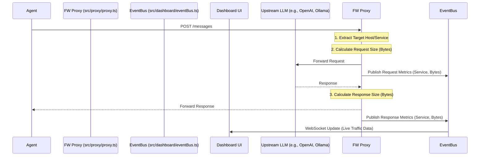

# Specification: Live Traffic Monitoring (SPEC-livetraffic.md)

This specification details how `llm-fw` will provide visibility into the proxy's activity, demonstrating to users that the firewall is actively intercepting, monitoring, and analyzing their AI traffic.

---

## 1. The Need: Proxy Visibility

Users running `llm-fw` need immediate, visual confirmation that their local agents and applications are successfully routing traffic through the proxy. Furthermore, they need insights into the volume and destination of this traffic to understand their AI usage and potential data exposure.

*   **The Problem**: A proxy operating silently in the background provides no feedback. Users might wonder, "Is it actually working?" or "How much data is this local agent sending to OpenAI?"
*   **The Solution**: Real-time traffic monitoring that tracks throughput (bytes/tokens) and identifies the downstream AI services being utilized.

---

## 2. Architecture: Traffic Metrics Collection

`llm-fw` will gather metrics at the proxy level during the request/response lifecycle and broadcast them to the local dashboard.

---

## 3. Metrics Strategies

### Strategy 1: Connection & Data Throughput Tracking
The proxy will intercept all traffic and calculate the size of the payloads.
*   **Byte Counting**: Track the `Content-Length` or calculate the byte size of chunked streams for both incoming requests and outgoing responses.
*   **Time-Series Aggregation**: Aggregate data over time windows (e.g., bytes per second/minute) to power live charts.

### Strategy 2: AI Service Identification
The proxy will identify which AI service is being called based on the request destination.
*   **Host Parsing**: Extract the host from the connection (e.g., `api.openai.com`, `api.anthropic.com`, `localhost:11434`).
*   **Categorization**: Map known hosts to specific services (OpenAI, Anthropic, Ollama, Custom).

---

## 4. Dashboard Visualization

The dashboard will introduce a new "Live Traffic" section featuring:
1.  **Throughput Graph**: A real-time chart showing data passing through the proxy (Requests/sec and Bytes/sec).
2.  **Service Utilization**: A breakdown of traffic by AI service (e.g., "OpenAI: 5MB", "Local Ollama: 12MB").
3.  **Active Connections log**: A scrolling list of recent requests showing the timestamp, target service, and data size.
