# Architecture: llm-fw

This document describes the internal design of llm-fw. It covers how the components
are structured, how a request flows through the system, and how each detection stage works.

---

## 1. System Context

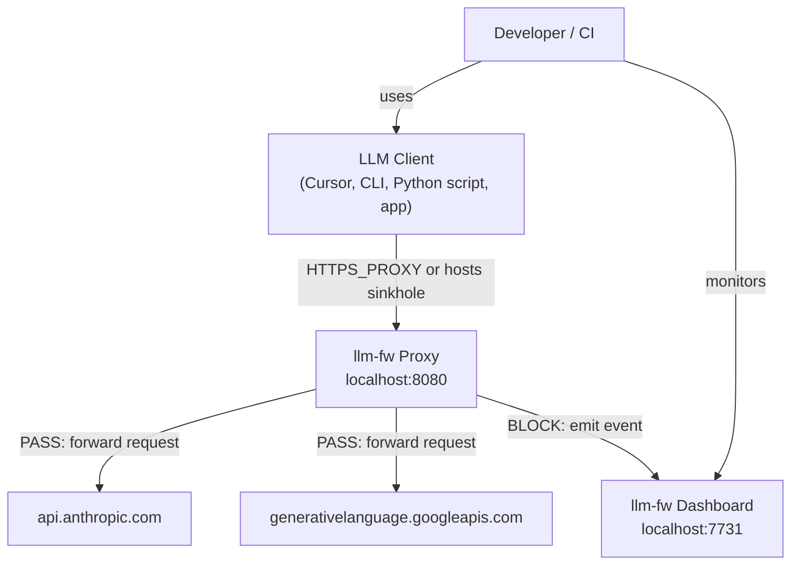

---

## 2. Component Map

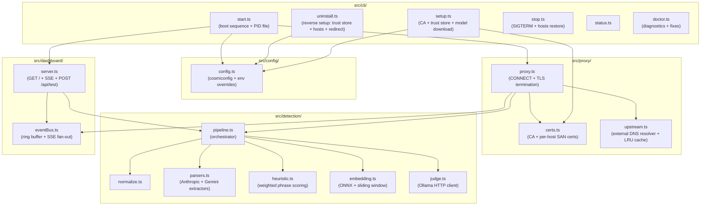

---

## 3. Class Diagram — Detection Pipeline

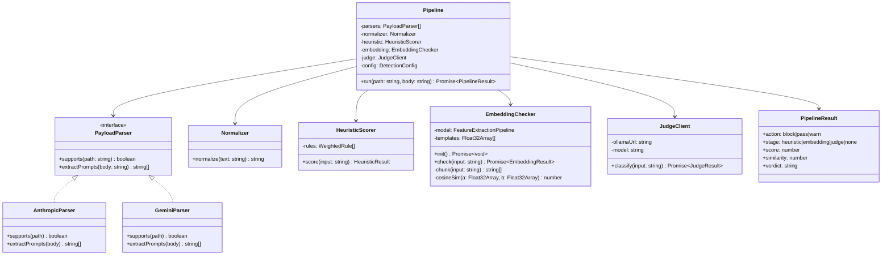

---

## 4. Class Diagram — Proxy

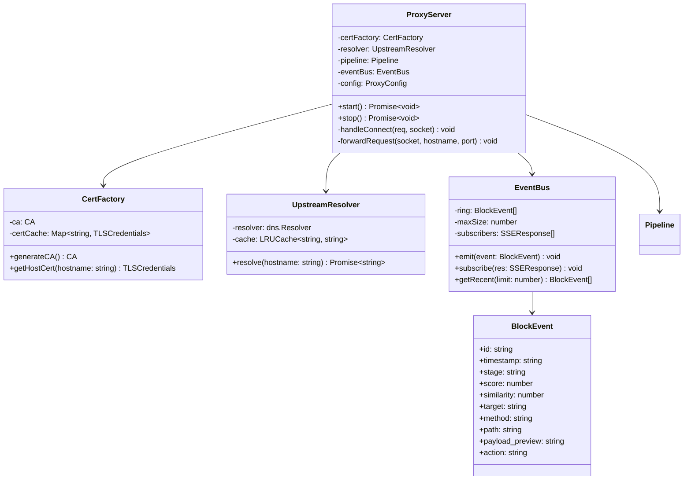

---

## 5. Sequence Diagram — Request PASS (Mode A: HTTPS_PROXY)

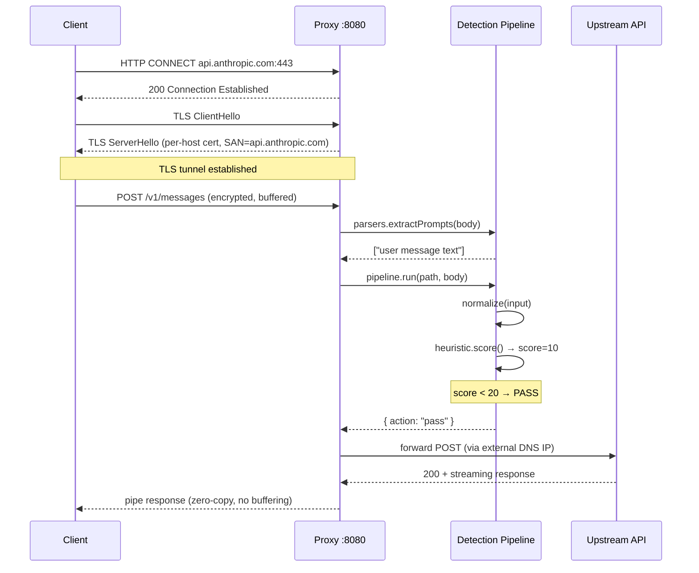

---

## 6. Sequence Diagram — Request BLOCK (Stage 2)

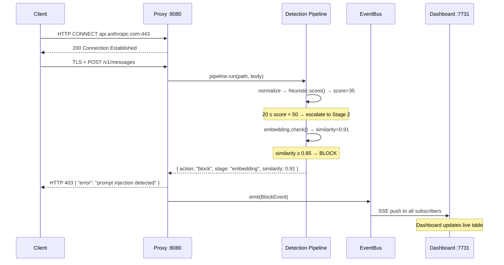

---

## 7. Sequence Diagram — Stage 3 Judge (Async Default)

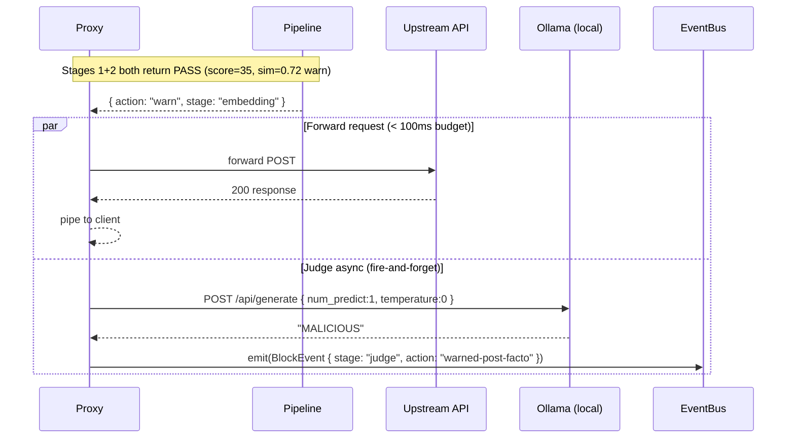

---

## 8. Sequence Diagram — Setup Flow

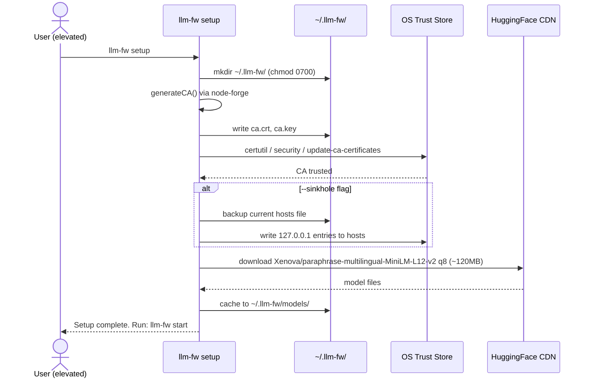

---

## 9. Pipeline State Machine

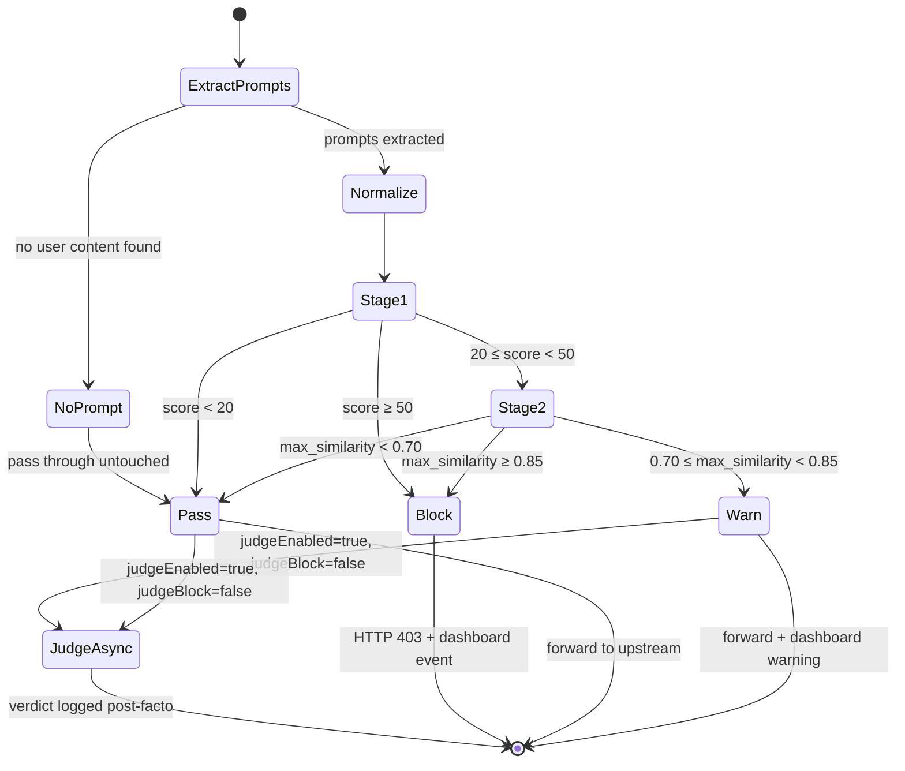

---

## 10. Data Flow — Embedding Sliding Window

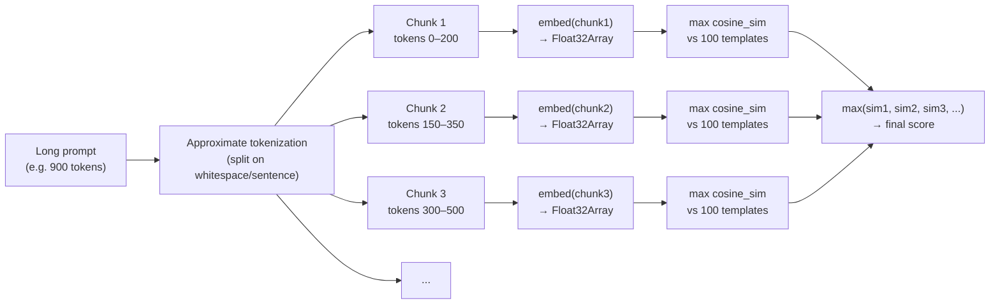

---

## 11. File Structure

```
llm-fw/
├── src/
│   ├── cli/
│   │   ├── setup.ts         # CA generation, trust store, hosts, model download
│   │   ├── setup-judge.ts   # Ollama model pull + judge config
│   │   ├── uninstall.ts     # reverse setup: trust store, hosts, redirect, files
│   │   ├── start.ts         # boot sequence, exit hooks, PID file
│   │   ├── stop.ts          # SIGTERM + hosts restore
│   │   ├── doctor.ts        # environment diagnostics + remediation commands
│   │   └── status.ts
│   ├── proxy/
│   │   ├── proxy.ts         # CONNECT handler, dual-mode (8080/443)
│   │   ├── certs.ts         # CA + per-host SAN cert factory
│   │   └── upstream.ts      # external DNS resolver + LRU cache
│   ├── detection/
│   │   ├── normalize.ts     # Unicode NFKC + zero-width strip
│   │   ├── parsers.ts       # Anthropic + Gemini payload extractors
│   │   ├── heuristic.ts     # weighted phrase scorer
│   │   ├── embedding.ts     # ONNX model + sliding-window checker
│   │   ├── judge.ts         # Ollama HTTP client
│   │   └── pipeline.ts      # orchestrator
│   ├── dashboard/
│   │   ├── server.ts        # HTTP server (Events + Playground + /api/test)
│   │   └── eventBus.ts      # ring buffer + SSE fan-out
│   └── config/
│       └── config.ts        # cosmiconfig + env overrides + defaults
├── data/
│   └── attacks.json         # ~100 canonical injection templates
├── test/
│   ├── detection/           # unit + integration tests per module
│   ├── proxy/               # proxy integration tests
│   └── dashboard/           # dashboard API tests
├── docs/
│   └── ARCHITECTURE.md      # this file
├── spec.md
├── PLAN.md
└── README.md
```

---

## 12. Install Settings — What `setup` Changes and Why

`llm-fw setup` is not a passive install: to transparently intercept HTTPS it has
to plant a trust anchor and (in sinkhole mode) redirect traffic at the OS level.
Every one of those changes is enumerated below with the reason it exists and the
exact reversal `uninstall` performs. The table is the contract between the two
commands — anything `setup` writes must appear here with an undo.

### 12.1 Files under `~/.llm-fw/`

| Setting | What it is | Why it's needed | Reversal |
| --- | --- | --- | --- |
| `ca.key` | RSA-2048 private key of the local root CA | The proxy signs a per-host leaf cert on the fly for every intercepted domain; without the CA key it can't terminate TLS, so it can't read request bodies to scan them. | delete file |
| `ca.crt` | Self-signed root CA certificate (CN `llm-fw Local CA`, 10-yr validity) | This is the public half installed into the OS trust store so clients accept the proxy's leaf certs instead of throwing cert errors. | delete file + remove from trust store (§12.2) |
| `ca.crl` | Empty, CA-signed Certificate Revocation List | Windows Schannel reads the CRL Distribution Point on every cert; with no reachable CRL it rejects the leaf as "revocation status unknown". An empty signed CRL satisfies that check. | delete file |
| dir perms `0700` / restricted ACL | `chmod 0700` (POSIX) or `icacls` inheritance-strip (Windows) on `~/.llm-fw` | The dir holds the CA private key. Any local process that could read it could silently MITM **all** the user's HTTPS traffic, so only the owner (and SYSTEM) may read the folder. | dir is deleted entirely |
| `models/` | Cached `Xenova/paraphrase-multilingual-MiniLM-L12-v2` q8 ONNX weights (~120 MB) | Stage 2 embeds prompts locally (multilingual, 50+ languages); caching avoids re-downloading on every start and keeps detection fully offline. | delete dir (`--keep-model` preserves it to avoid a re-download) |
| `config.json` | `{ "proxy": { "mode": "proxy" \| "sinkhole" } }` | Persists which mode setup configured so `start`, `status`, and `doctor` report and behave correctly without re-passing flags or env vars. Loaded by `config.ts` above project config, below env vars. | delete file |
| `llm-fw.pid` | PID of the running proxy (written by `start`) | Lets `stop`/`status`/`doctor`/`uninstall` find and signal the live process. | proxy stopped, then file deleted |

### 12.2 OS trust store (CA installed system-wide)

| Platform | Install command | Why | Reversal |
| --- | --- | --- | --- |
| Windows | `certutil -addstore -f Root <ca.crt>` | Adds the CA to the machine **Root** store so Schannel-based and Node clients trust the proxy's leaf certs. | `certutil -delstore -f Root "llm-fw Local CA"` |
| macOS | `security add-trusted-cert -d -r trustRoot -k /Library/Keychains/System.keychain` | Same, via the System keychain. | `security delete-certificate -c "llm-fw Local CA" …` |
| Linux | copy to `/usr/local/share/ca-certificates/` + `update-ca-certificates` | Same, via the system CA bundle. | delete the file + `update-ca-certificates --fresh` |

**Why trust at all:** the proxy presents a cert it generated, not the real
provider's. Without trusting the CA, every client would (correctly) reject it.
This is the single most security-sensitive setting — it's why the CA key is
locked down (§12.1) and why `uninstall` removes the anchor first.

### 12.3 Sinkhole settings (elevated installs only)

Mode A (proxy) needs none of these — it relies on the client honouring
`HTTPS_PROXY`. Mode B (sinkhole) covers tools that *ignore* proxy env vars
(Node.js, native SDKs) by redirecting at the OS level, which requires admin/root.

| Setting | What it is | Why it's needed | Reversal |
| --- | --- | --- | --- |
| hosts file block | `# llm-fw sinkhole` marker + `127.0.0.1 <host>` for every target provider | Forces DNS for provider domains to loopback so their traffic hits the local TLS server instead of the real API — no client config required. | strip the marker block + any target loopback line (`stripSinkholeBlock`) |
| `hosts.llm-fw.bak` | Pre-edit copy of the hosts file | Safety net so the original can be restored if anything goes wrong. | delete after the hosts file is cleaned |
| port redirect | `netsh portproxy 443→httpsPort` (Win) / `pf rdr` (macOS) / `iptables REDIRECT` (Linux) | The sinkhole TLS server runs on an unprivileged port (8443); this forwards loopback `:443` to it so clients reach it on the standard HTTPS port. | delete the rule (`netsh … delete` / `pfctl -F nat` / `iptables -D`) |
| `iphlpsvc` running | Windows IP Helper service set to auto + started | `netsh portproxy` rules only forward while IP Helper is running. | **left in place** — it's a shared Windows service other software relies on; documented, not reverted |

### 12.4 Stage 3 judge settings (`setup-judge`, optional)

| Setting | What it is | Why it's needed | Reversal |
| --- | --- | --- | --- |
| Ollama model pull | e.g. `ollama pull phi3` | Stage 3 runs a local LLM to reason about intent that regex/similarity miss. | **left in place** — the model is shared and reusable; `uninstall` prints `ollama rm <model>` |
| `.llm-fw.json` judge keys | `detection.judgeEnabled / judgeModel / judgeBlock` written to the project config | Persists that the judge is enabled and which model/blocking mode to use. | strip only those keys (`stripJudgeConfig`); delete the file if nothing user-authored remains |

### 12.5 Environment variables (printed, never set)

`setup` **prints** `HTTPS_PROXY` and `NODE_EXTRA_CA_CERTS` for the user to
export; it never sets them itself, so it doesn't own them. `uninstall`
therefore can't remove them — it reminds the user to `unset` them and delete the
matching lines from their shell profile.

---

## 13. Uninstall Flow

`llm-fw uninstall` reverses §12 in dependency order: stop the proxy, pull the
trust anchor, undo the sinkhole, then delete local files. Every OS-touching step
is best-effort — a step that fails (rule already gone, or not elevated) prints a
warning and the manual command rather than aborting the rest. The pure
transforms (`stripSinkholeBlock`, `stripJudgeConfig`) are unit-tested in
`test/cli/uninstall.test.ts`.

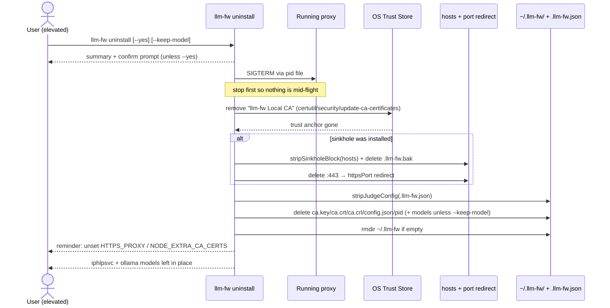
