# Architecture: llm-fw

This document describes the internal design of llm-fw. It covers how the components
are structured, how a request flows through the system, and how each detection stage works.

---

## 1. System Context

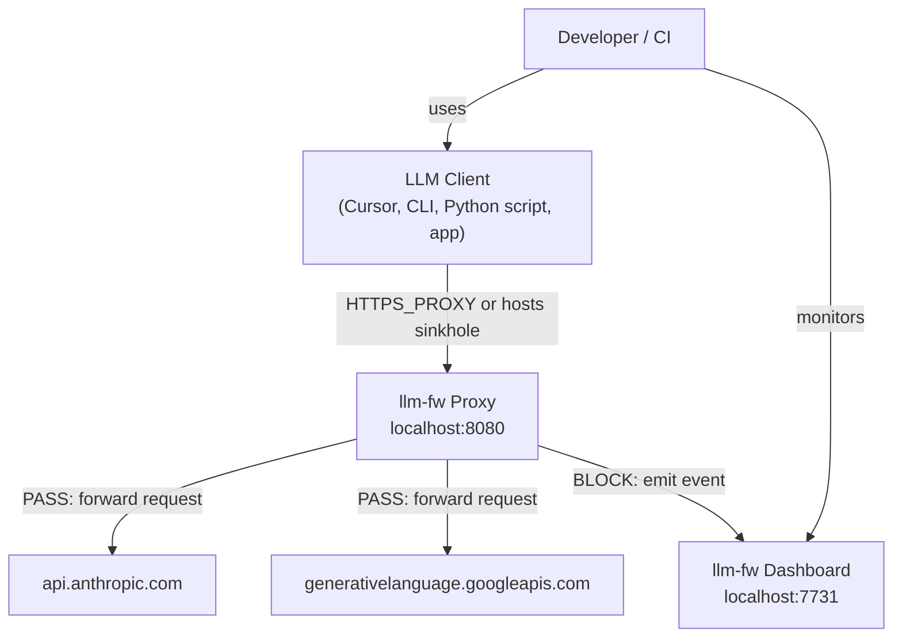
```mermaid
flowchart TD
    User["Developer / CI"]
    Client["LLM Client\n(Cursor, CLI, Python script, app)"]
    Proxy["llm-fw Proxy\nlocalhost:8080"]
    Dashboard["llm-fw Dashboard\nlocalhost:7731"]
    Anthropic["api.anthropic.com"]
    Google["generativelanguage.googleapis.com"]

    User -->|uses| Client
    Client -->|HTTPS_PROXY or hosts sinkhole| Proxy
    Proxy -->|PASS: forward request| Anthropic
    Proxy -->|PASS: forward request| Google
    Proxy -->|BLOCK: emit event| Dashboard
    User -->|monitors| Dashboard
```



---

## 2. Component Map

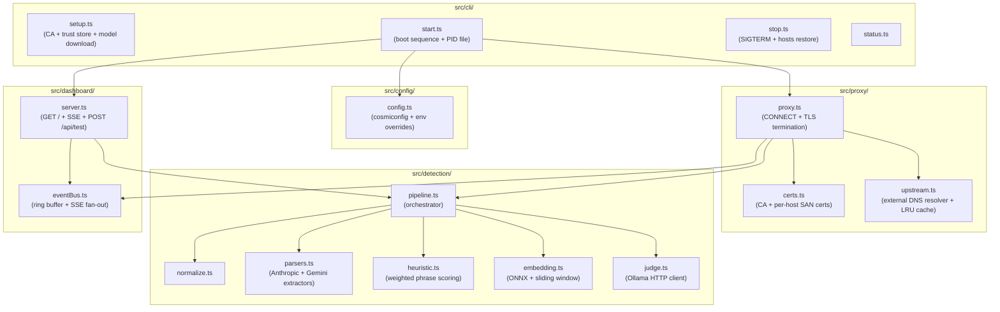
```mermaid
flowchart TD
    subgraph CLI ["src/cli/"]
        setup["setup.ts\n(CA + trust store + model download)"]
        start["start.ts\n(boot sequence + PID file)"]
        stop["stop.ts\n(SIGTERM + hosts restore)"]
        status["status.ts"]
    end

    subgraph Config ["src/config/"]
        cfg["config.ts\n(cosmiconfig + env overrides)"]
    end

    subgraph Proxy ["src/proxy/"]
        proxyServer["proxy.ts\n(CONNECT + TLS termination)"]
        certs["certs.ts\n(CA + per-host SAN certs)"]
        upstream["upstream.ts\n(external DNS resolver + LRU cache)"]
    end

    subgraph Detection ["src/detection/"]
        normalizer["normalize.ts"]
        parsers["parsers.ts\n(Anthropic + Gemini extractors)"]
        heuristic["heuristic.ts\n(weighted phrase scoring)"]
        embedding["embedding.ts\n(ONNX + sliding window)"]
        judge["judge.ts\n(Ollama HTTP client)"]
        pipeline["pipeline.ts\n(orchestrator)"]
    end

    subgraph Dashboard ["src/dashboard/"]
        httpServer["server.ts\n(GET / + SSE + POST /api/test)"]
        eventBus["eventBus.ts\n(ring buffer + SSE fan-out)"]
    end

    start --> cfg
    start --> proxyServer
    start --> httpServer
    proxyServer --> certs
    proxyServer --> upstream
    proxyServer --> pipeline
    pipeline --> parsers
    pipeline --> normalizer
    pipeline --> heuristic
    pipeline --> embedding
    pipeline --> judge
    proxyServer --> eventBus
    httpServer --> eventBus
    httpServer --> pipeline
```



---

## 3. Class Diagram — Detection Pipeline


```mermaid
classDiagram
    class PayloadParser {
        <<interface>>
        +supports(path: string) boolean
        +extractPrompts(body: string) string[]
    }

    class AnthropicParser {
        +supports(path) boolean
        +extractPrompts(body) string[]
    }

    class GeminiParser {
        +supports(path) boolean
        +extractPrompts(body) string[]
    }

    class Normalizer {
        +normalize(text: string) string
    }

    class HeuristicScorer {
        -rules: WeightedRule[]
        +score(input: string) HeuristicResult
    }

    class EmbeddingChecker {
        -model: FeatureExtractionPipeline
        -templates: Float32Array[]
        +init() Promise~void~
        +check(input: string) Promise~EmbeddingResult~
        -chunk(input: string) string[]
        -cosineSim(a: Float32Array, b: Float32Array) number
    }

    class JudgeClient {
        -ollamaUrl: string
        -model: string
        +classify(input: string) Promise~JudgeResult~
    }

    class Pipeline {
        -parsers: PayloadParser[]
        -normalizer: Normalizer
        -heuristic: HeuristicScorer
        -embedding: EmbeddingChecker
        -judge: JudgeClient
        -config: DetectionConfig
        +run(path: string, body: string) Promise~PipelineResult~
    }

    class PipelineResult {
        +action: block|pass|warn
        +stage: heuristic|embedding|judge|none
        +score: number
        +similarity: number
        +verdict: string
    }

    PayloadParser <|.. AnthropicParser
    PayloadParser <|.. GeminiParser
    Pipeline --> PayloadParser
    Pipeline --> Normalizer
    Pipeline --> HeuristicScorer
    Pipeline --> EmbeddingChecker
    Pipeline --> JudgeClient
    Pipeline --> PipelineResult
```



---

## 4. Class Diagram — Proxy

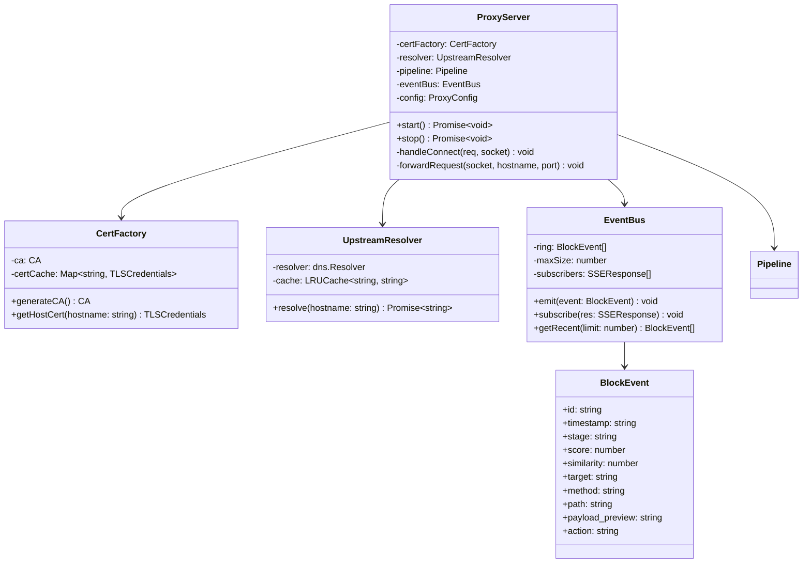
```mermaid
classDiagram
    class ProxyServer {
        -certFactory: CertFactory
        -resolver: UpstreamResolver
        -pipeline: Pipeline
        -eventBus: EventBus
        -config: ProxyConfig
        +start() Promise~void~
        +stop() Promise~void~
        -handleConnect(req, socket) void
        -forwardRequest(socket, hostname, port) void
    }

    class CertFactory {
        -ca: CA
        -certCache: Map~string, TLSCredentials~
        +generateCA() CA
        +getHostCert(hostname: string) TLSCredentials
    }

    class UpstreamResolver {
        -resolver: dns.Resolver
        -cache: LRUCache~string, string~
        +resolve(hostname: string) Promise~string~
    }

    class EventBus {
        -ring: BlockEvent[]
        -maxSize: number
        -subscribers: SSEResponse[]
        +emit(event: BlockEvent) void
        +subscribe(res: SSEResponse) void
        +getRecent(limit: number) BlockEvent[]
    }

    class BlockEvent {
        +id: string
        +timestamp: string
        +stage: string
        +score: number
        +similarity: number
        +target: string
        +method: string
        +path: string
        +payload_preview: string
        +action: string
    }

    ProxyServer --> CertFactory
    ProxyServer --> UpstreamResolver
    ProxyServer --> Pipeline
    ProxyServer --> EventBus
    EventBus --> BlockEvent
```



---

## 5. Sequence Diagram — Request PASS (Mode A: HTTPS_PROXY)

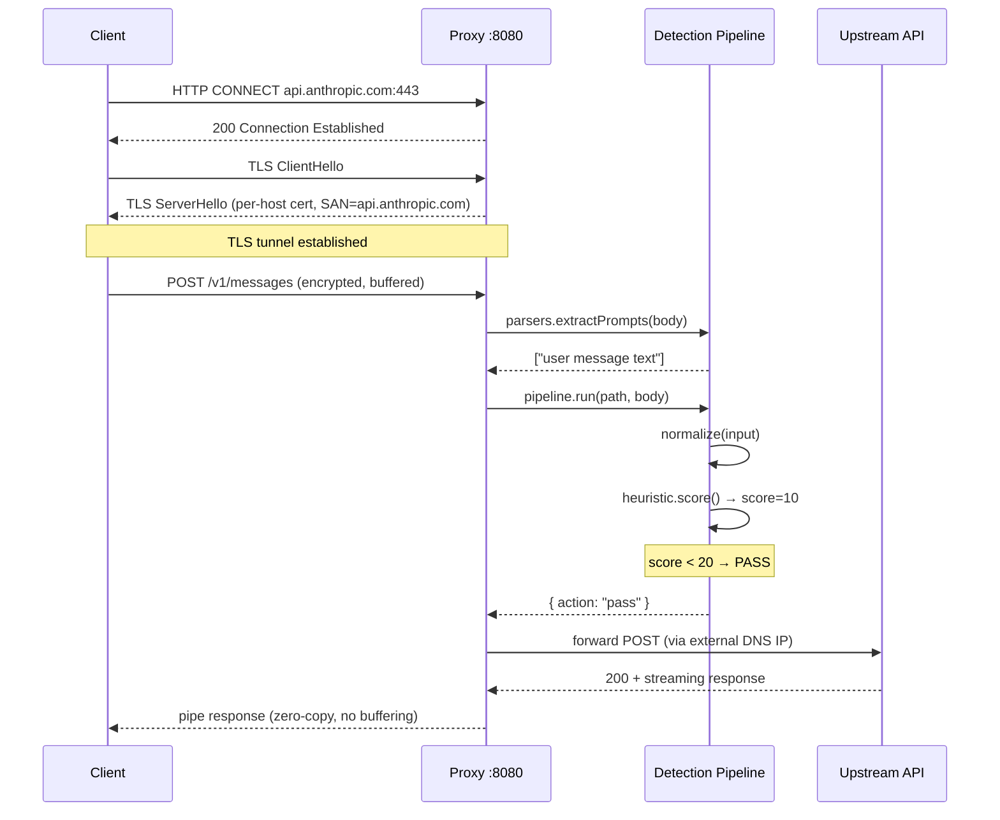
```mermaid
sequenceDiagram
    participant C as Client
    participant P as Proxy :8080
    participant Det as Detection Pipeline
    participant Up as Upstream API

    C->>P: HTTP CONNECT api.anthropic.com:443
    P-->>C: 200 Connection Established
    C->>P: TLS ClientHello
    P-->>C: TLS ServerHello (per-host cert, SAN=api.anthropic.com)
    Note over C,P: TLS tunnel established

    C->>P: POST /v1/messages (encrypted, buffered)
    P->>Det: parsers.extractPrompts(body)
    Det-->>P: ["user message text"]
    P->>Det: pipeline.run(path, body)
    Det->>Det: normalize(input)
    Det->>Det: heuristic.score() → score=10
    Note over Det: score < 20 → PASS
    Det-->>P: { action: "pass" }

    P->>Up: forward POST (via external DNS IP)
    Up-->>P: 200 + streaming response
    P-->>C: pipe response (zero-copy, no buffering)
```

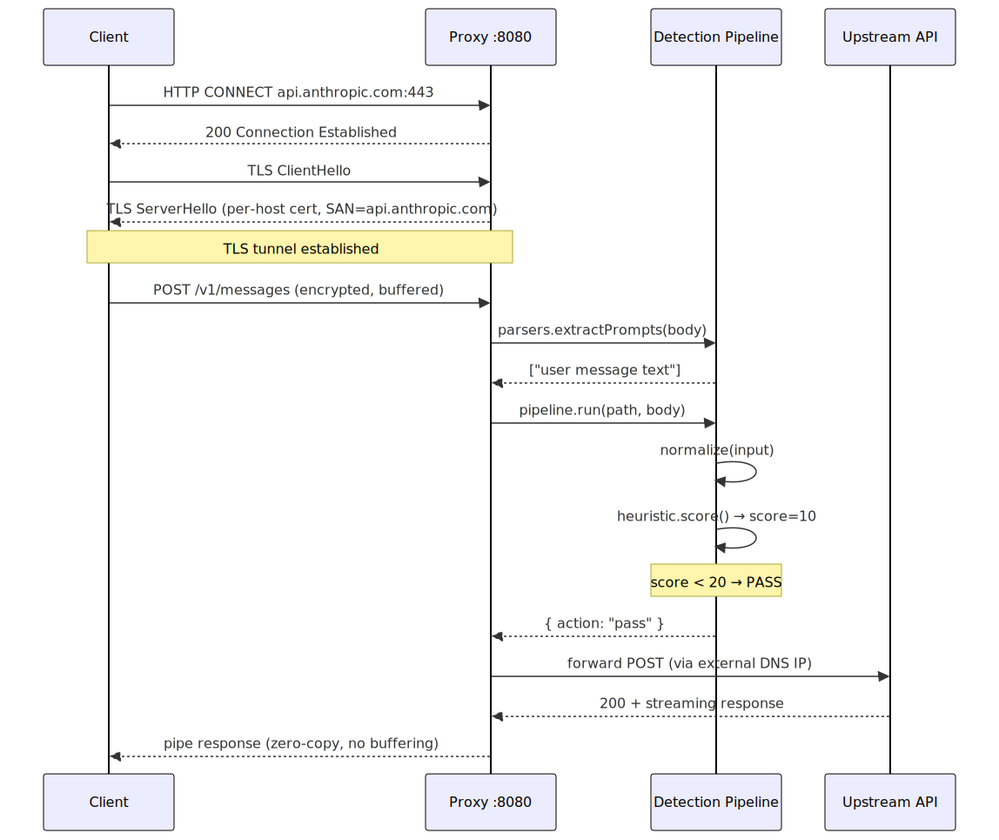

---

## 6. Sequence Diagram — Request BLOCK (Stage 2)

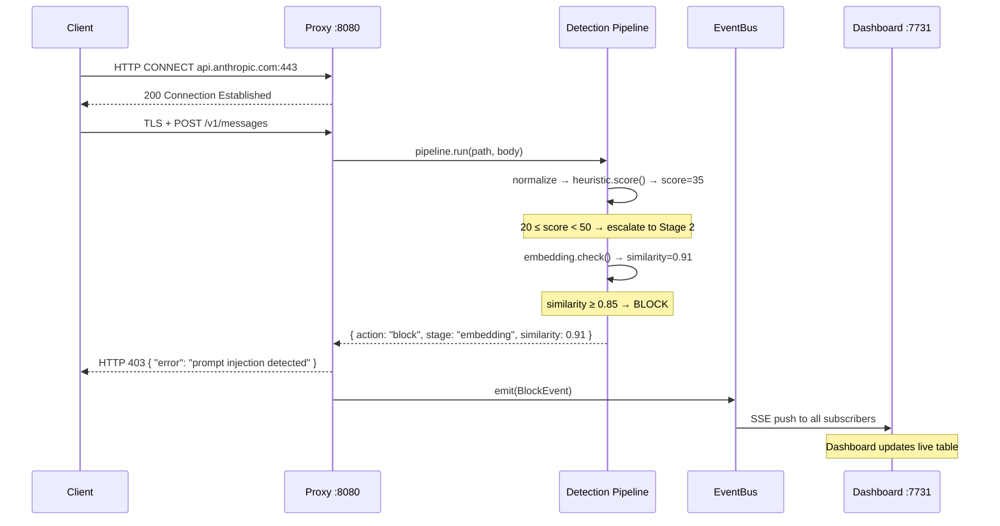
```mermaid
sequenceDiagram
    participant C as Client
    participant P as Proxy :8080
    participant Det as Detection Pipeline
    participant EB as EventBus
    participant DB as Dashboard :7731

    C->>P: HTTP CONNECT api.anthropic.com:443
    P-->>C: 200 Connection Established
    C->>P: TLS + POST /v1/messages
    P->>Det: pipeline.run(path, body)
    Det->>Det: normalize → heuristic.score() → score=35
    Note over Det: 20 ≤ score < 50 → escalate to Stage 2
    Det->>Det: embedding.check() → similarity=0.91
    Note over Det: similarity ≥ 0.85 → BLOCK
    Det-->>P: { action: "block", stage: "embedding", similarity: 0.91 }

    P-->>C: HTTP 403 { "error": "prompt injection detected" }

    P->>EB: emit(BlockEvent)
    EB->>DB: SSE push to all subscribers
    Note over DB: Dashboard updates live table
```

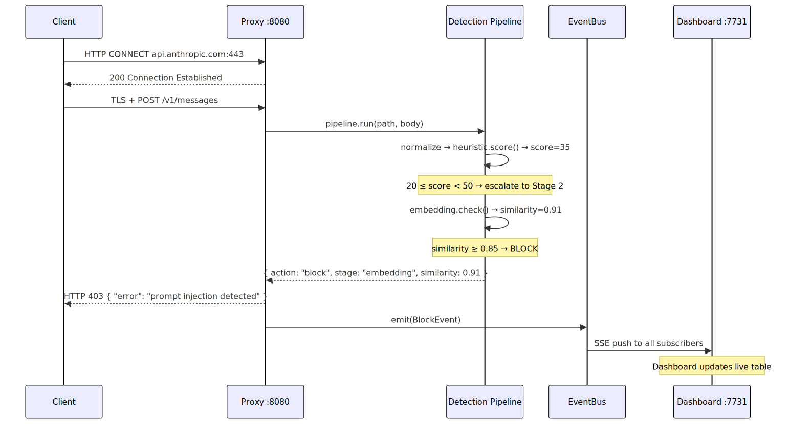

---

## 7. Sequence Diagram — Stage 3 Judge (Async Default)

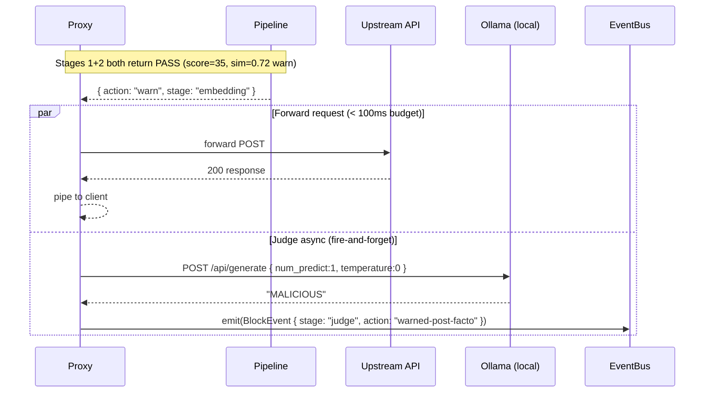
```mermaid
sequenceDiagram
    participant P as Proxy
    participant Det as Pipeline
    participant Up as Upstream API
    participant Ollama as Ollama (local)
    participant EB as EventBus

    Note over P,Det: Stages 1+2 both return PASS (score=35, sim=0.72 warn)
    Det-->>P: { action: "warn", stage: "embedding" }

    par Forward request (< 100ms budget)
        P->>Up: forward POST
        Up-->>P: 200 response
        P-->>P: pipe to client
    and Judge async (fire-and-forget)
        P->>Ollama: POST /api/generate { num_predict:1, temperature:0 }
        Ollama-->>P: "MALICIOUS"
        P->>EB: emit(BlockEvent { stage: "judge", action: "warned-post-facto" })
    end
```

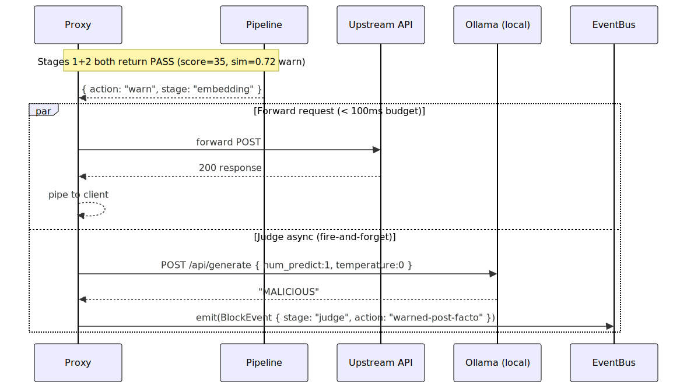

---

## 8. Sequence Diagram — Setup Flow

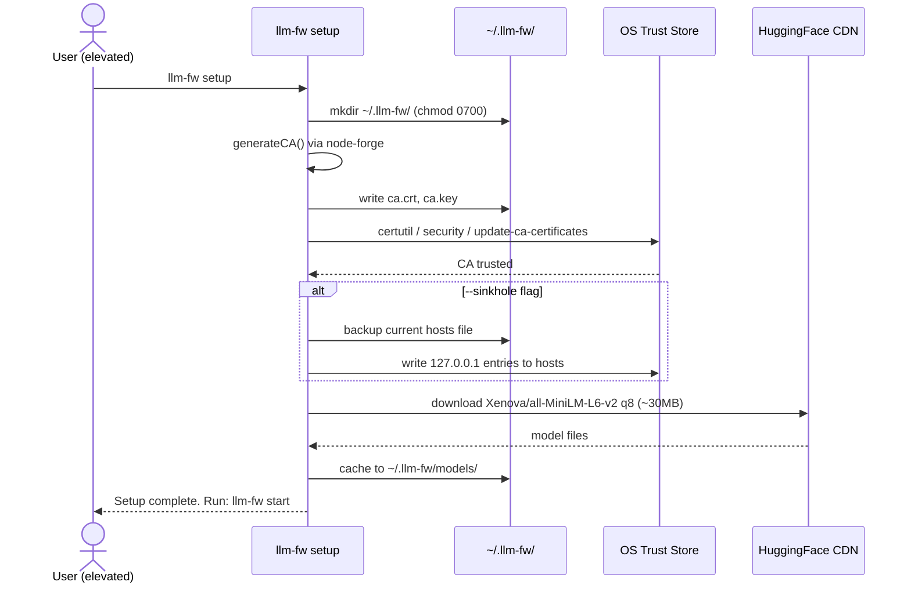
```mermaid
sequenceDiagram
    actor U as User (elevated)
    participant CLI as llm-fw setup
    participant FS as ~/.llm-fw/
    participant OS as OS Trust Store
    participant HF as HuggingFace CDN

    U->>CLI: llm-fw setup
    CLI->>FS: mkdir ~/.llm-fw/ (chmod 0700)
    CLI->>CLI: generateCA() via node-forge
    CLI->>FS: write ca.crt, ca.key
    CLI->>OS: certutil / security / update-ca-certificates
    OS-->>CLI: CA trusted

    alt --sinkhole flag
        CLI->>FS: backup current hosts file
        CLI->>OS: write 127.0.0.1 entries to hosts
    end

    CLI->>HF: download Xenova/all-MiniLM-L6-v2 q8 (~30MB)
    HF-->>CLI: model files
    CLI->>FS: cache to ~/.llm-fw/models/
    CLI-->>U: Setup complete. Run: llm-fw start
```

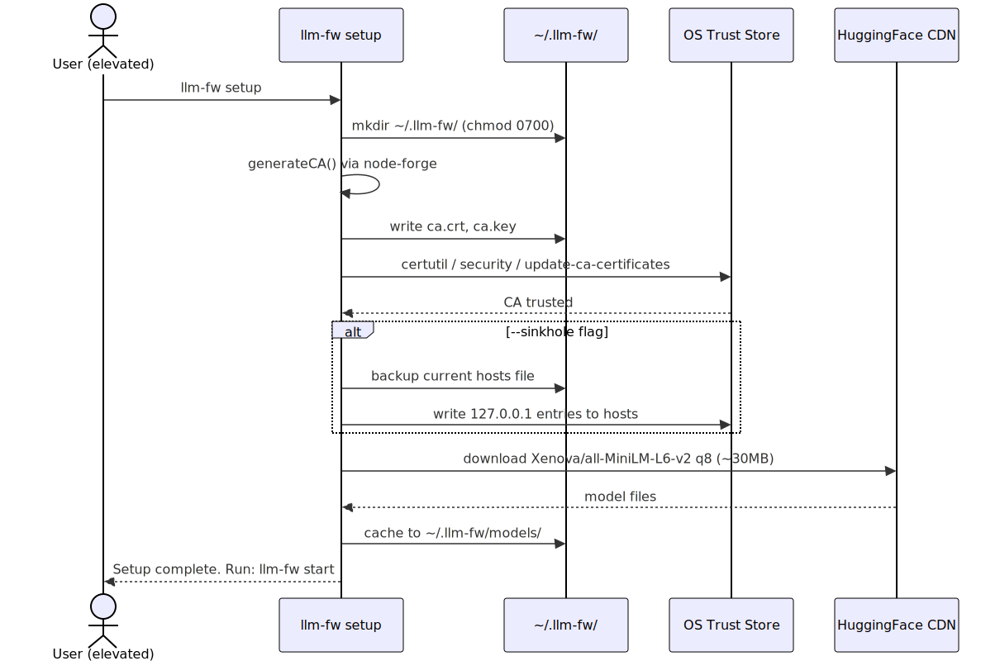

---

## 9. Pipeline State Machine

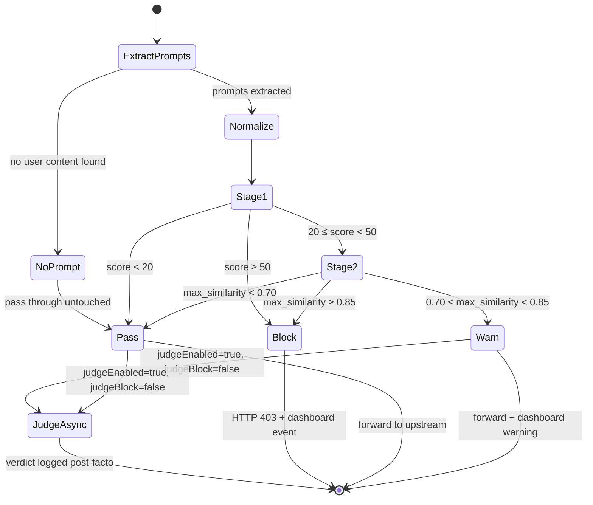
```mermaid
stateDiagram-v2
    [*] --> ExtractPrompts

    ExtractPrompts --> NoPrompt : no user content found
    ExtractPrompts --> Normalize : prompts extracted

    NoPrompt --> Pass : pass through untouched

    Normalize --> Stage1

    Stage1 --> Block : score ≥ 50
    Stage1 --> Stage2 : 20 ≤ score < 50
    Stage1 --> Pass : score < 20

    Stage2 --> Block : max_similarity ≥ 0.85
    Stage2 --> Warn : 0.70 ≤ max_similarity < 0.85
    Stage2 --> Pass : max_similarity < 0.70

    Warn --> JudgeAsync : judgeEnabled=true, judgeBlock=false
    Pass --> JudgeAsync : judgeEnabled=true, judgeBlock=false

    JudgeAsync --> [*] : verdict logged post-facto

    Block --> [*] : HTTP 403 + dashboard event
    Pass --> [*] : forward to upstream
    Warn --> [*] : forward + dashboard warning
```



---

## 10. Data Flow — Embedding Sliding Window

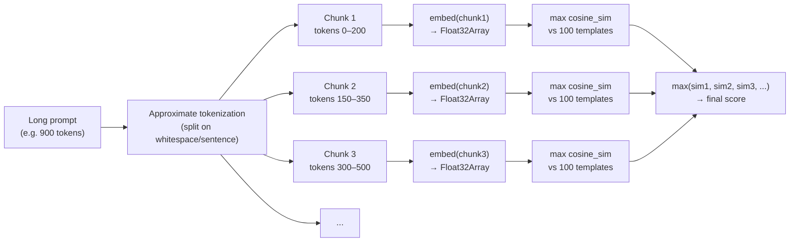
```mermaid
flowchart LR
    Input["Long prompt\n(e.g. 900 tokens)"]
    Tokenize["Approximate tokenization\n(split on whitespace/sentence)"]
    Chunk1["Chunk 1\ntokens 0–200"]
    Chunk2["Chunk 2\ntokens 150–350"]
    Chunk3["Chunk 3\ntokens 300–500"]
    ChunkN["..."]

    Embed1["embed(chunk1)\n→ Float32Array"]
    Embed2["embed(chunk2)\n→ Float32Array"]
    Embed3["embed(chunk3)\n→ Float32Array"]

    Sim1["max cosine_sim\nvs 100 templates"]
    Sim2["max cosine_sim\nvs 100 templates"]
    Sim3["max cosine_sim\nvs 100 templates"]

    MaxScore["max(sim1, sim2, sim3, ...)\n→ final score"]

    Input --> Tokenize
    Tokenize --> Chunk1 & Chunk2 & Chunk3 & ChunkN
    Chunk1 --> Embed1 --> Sim1
    Chunk2 --> Embed2 --> Sim2
    Chunk3 --> Embed3 --> Sim3
    Sim1 & Sim2 & Sim3 --> MaxScore
```



---

## 11. File Structure

```
llm-fw/
├── src/
│   ├── cli/
│   │   ├── setup.ts         # CA generation, trust store, hosts, model download
│   │   ├── start.ts         # boot sequence, exit hooks, PID file
│   │   ├── stop.ts          # SIGTERM + hosts restore
│   │   └── status.ts
│   ├── proxy/
│   │   ├── proxy.ts         # CONNECT handler, dual-mode (8080/443)
│   │   ├── certs.ts         # CA + per-host SAN cert factory
│   │   └── upstream.ts      # external DNS resolver + LRU cache
│   ├── detection/
│   │   ├── normalize.ts     # Unicode NFKC + zero-width strip
│   │   ├── parsers.ts       # Anthropic + Gemini payload extractors
│   │   ├── heuristic.ts     # weighted phrase scorer
│   │   ├── embedding.ts     # ONNX model + sliding-window checker
│   │   ├── judge.ts         # Ollama HTTP client
│   │   └── pipeline.ts      # orchestrator
│   ├── dashboard/
│   │   ├── server.ts        # HTTP server (Events + Playground + /api/test)
│   │   └── eventBus.ts      # ring buffer + SSE fan-out
│   └── config/
│       └── config.ts        # cosmiconfig + env overrides + defaults
├── data/
│   └── attacks.json         # ~100 canonical injection templates
├── test/
│   ├── detection/           # unit + integration tests per module
│   ├── proxy/               # proxy integration tests
│   └── dashboard/           # dashboard API tests
├── docs/
│   └── ARCHITECTURE.md      # this file
├── spec.md
├── PLAN.md
└── README.md
```
