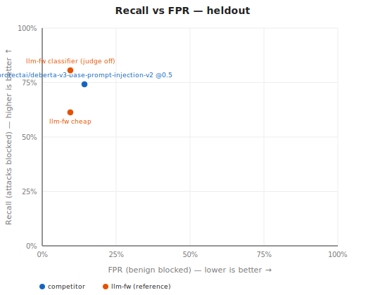
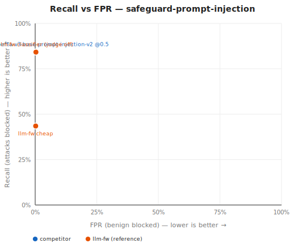
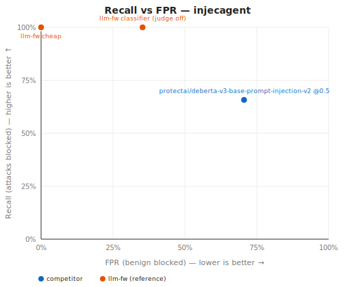

# Competitor guardrail head-to-head (Task B6, Option A)

Generated 2026-07-05. Independent generalization benchmark (see docs/BENCHMARK.md methodology) run against third-party prompt-injection/jailbreak guardrails on the same held-out splits llm-fw is measured on: recall = attacks blocked, FPR = benign blocked. Different threat models (direct injection vs. indirect injection) are reported separately and never averaged. The llm-fw reference rows are NOT re-run here — they are copied from docs/BENCHMARK-IMPROVEMENTS.md (Round 6) for side-by-side comparison.

### heldout (injection, n=52)

| Guardrail | Recall | FPR | Status |
|---|---|---|---|
| **llm-fw cheap** (reference) | 61.3% | 9.5% | reference — see docs/BENCHMARK-IMPROVEMENTS.md |
| **llm-fw classifier (judge off)** (reference) | 80.6% | 9.5% | reference — see docs/BENCHMARK-IMPROVEMENTS.md |
| protectai/deberta-v3-base-prompt-injection-v2 @0.5 | 74.2% | 14.3% | ran |
| meta-llama/Prompt-Guard-86M | — | — | not run: gated model (accept the Meta license at huggingface.co and set HF_TOKEN) |
| llama-guard-3 (ollama:llama-guard3) | — | — | not run: Ollama reachable but llama-guard3 is not pulled (run `ollama pull llama-guard3`) |
| lakera-guard (hosted API) | — | — | not run: LAKERA_API_KEY not set |



### safeguard-prompt-injection (injection, n=2060)

| Guardrail | Recall | FPR | Status |
|---|---|---|---|
| **llm-fw cheap** (reference) | 43.5% | 0.2% | reference — see docs/BENCHMARK-IMPROVEMENTS.md |
| **llm-fw classifier (judge off)** (reference) | 84.2% | 0.3% | reference — see docs/BENCHMARK-IMPROVEMENTS.md |
| protectai/deberta-v3-base-prompt-injection-v2 @0.5 | 84.3% | 0.1% | ran |
| meta-llama/Prompt-Guard-86M | — | — | not run: gated model (accept the Meta license at huggingface.co and set HF_TOKEN) |
| llama-guard-3 (ollama:llama-guard3) | — | — | not run: Ollama reachable but llama-guard3 is not pulled (run `ollama pull llama-guard3`) |
| lakera-guard (hosted API) | — | — | not run: LAKERA_API_KEY not set |



### injecagent (indirect-injection, n=1071)

| Guardrail | Recall | FPR | Status |
|---|---|---|---|
| **llm-fw cheap** (reference) | 100.0% | 0.0% | reference — see docs/BENCHMARK-IMPROVEMENTS.md |
| **llm-fw classifier (judge off)** (reference) | 100.0% | 35.3% | reference — see docs/BENCHMARK-IMPROVEMENTS.md |
| protectai/deberta-v3-base-prompt-injection-v2 @0.5 | 65.7% | 70.6% | ran |
| meta-llama/Prompt-Guard-86M | — | — | not run: gated model (accept the Meta license at huggingface.co and set HF_TOKEN) |
| llama-guard-3 (ollama:llama-guard3) | — | — | not run: Ollama reachable but llama-guard3 is not pulled (run `ollama pull llama-guard3`) |
| lakera-guard (hosted API) | — | — | not run: LAKERA_API_KEY not set |



## Adapters not run

- **meta-llama/Prompt-Guard-86M** — not run: gated model (accept the Meta license at huggingface.co and set HF_TOKEN)
- **llama-guard-3 (ollama:llama-guard3)** — not run: Ollama reachable but llama-guard3 is not pulled (run `ollama pull llama-guard3`)
- **lakera-guard (hosted API)** — not run: LAKERA_API_KEY not set

## Reproduce

```
npm run bench:competitors
```

Runs each split in its own subprocess with an enlarged heap (`--max-old-space-size=8192`) so a local ONNX model load cannot OOM a single long-lived process — the lesson from Task B1.
